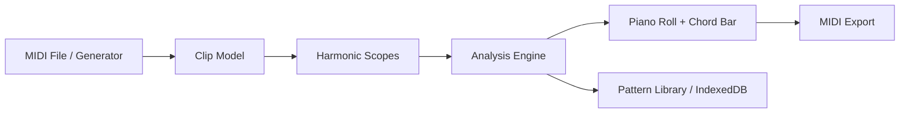
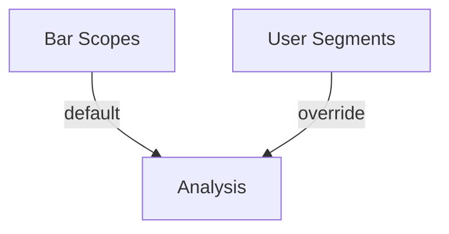

# MIDIcurator — Architecture Overview

This document describes the **developer-facing architecture** of MIDIcurator.
It is intended to support:

- maintenance and refactoring of the existing codebase,
- implementation of planned roadmap features,
- and reimplementation of MIDIcurator in another language or platform (e.g. JUCE plugin).

The architecture emphasizes **musical meaning**, **testability**, and **long-term portability**.

---

## 1. Architectural principles

### 1.1 Core invariants

These principles must hold across all implementations:

1. **Curation over production**
   - MIDIcurator prepares and explains musical material.
   - It does not replace DAWs or full sequencers.

2. **Analysis is assistive, not authoritative**
   - Harmonic labels are interpretations.
   - Users must be able to override or reinterpret results.

3. **Patterns are first-class objects**
   - Short musical ideas are the unit of work.
   - Full-song timelines are out of scope.

4. **Accessibility is foundational**
   - Avoid hidden state.
   - Avoid implicit rules.
   - Prefer visible, explainable actions.

---

## 2. High-level system layout



---

## 3. Core domain model

### 3.1 Fundamental types

```ts
NoteEvent {
  pitch: number        // MIDI note number (0–127)
  startTick: number
  endTick: number
  velocity: number
}
```

```ts
Clip {
  id: string
  ppq: number
  timeSignature?: [number, number]
  tempo?: number
  notes: NoteEvent[]
}
```

```ts
HarmonicScope {
  id: string
  startTick: number
  endTick: number
  kind: 'bar' | 'segment'
}
```

```ts
DetectedHarmony {
  scopeId: string
  match?: ChordMatch
  spellingContext?: SpellingContext
}
```

---

## 4. Bar-based harmonic scopes (current)

- Bars are automatically derived from:
  - PPQ
  - time signature
  - tempo
- Each bar defines a **default harmonic scope**
- Chords are detected per bar

Bars are **implicit segments**:
- visible in timing,
- invisible as semantic objects.

This design supports onboarding and stability.

---

## 5. Planned evolution: explicit segmentation

User-defined segmentation overlays bar scopes.

- Bars remain default.
- User-defined cut points create **segment scopes**.
- Segments override bars for harmonic analysis.



Segments are:
- semantic (harmonic meaning),
- not timeline edits,
- not DAW regions.

---

## 6. Separation of concerns

### 6.1 Pure musical logic (`lib/`)

Must be:
- deterministic,
- stateless,
- unit-testable.

Includes:
- chord detection
- pitch-class analysis
- enharmonic spelling
- transformations (density, variants)

### 6.2 UI / interaction layer (React)

Responsible for:
- rendering (canvas piano roll),
- user interaction,
- state orchestration.

No musical logic should live here.

---

## 7. Portability guidance

To reimplement MIDIcurator elsewhere:

### Portable core
- MIDI parse/write
- time grid generation
- harmonic analysis
- spelling logic
- pattern transforms

### Host-specific UI
- piano roll rendering
- segmentation interaction
- playback engine
- storage (IndexedDB / filesystem / plugin state)

---

## 8. Testing philosophy

- Every musical rule must have unit tests.
- Edge cases are musical, not exceptional.
- Regressions should be caught via pitch-class tests, not UI tests.

---

## 9. Non-goals

Explicitly out of scope:
- full timeline editing
- audio rendering
- arrangement tools
- DAW feature parity

These constraints protect MIDIcurator’s identity.
