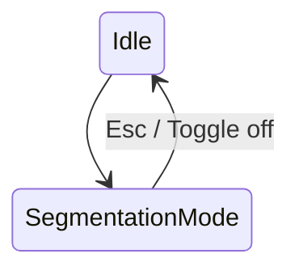
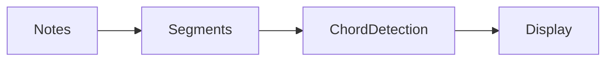

# MIDIcurator — Segmentation & Harmonic Scopes

This document defines how MIDIcurator handles
**harmonic segmentation**, including the planned
“scissors” tool.

Segmentation defines *musical meaning*, not editing regions.

---

## 1. Current behavior (baseline)

- Bars are automatically computed.
- Each bar defines a harmonic scope.
- Chords are detected per bar.

Bars are implicit segments.

---

## 2. Motivation for explicit segmentation

Bar-based scopes fail when:
- chords change mid-bar,
- harmonic rhythm is irregular,
- patterns are not metrically aligned.

Manual segmentation solves this without DAW complexity.

---

## 3. Design constraints

- Segmentation must be **lightweight**
- No region dragging or resizing
- One action = one cut
- Segments affect analysis, not playback timing

---

## 4. Segmentation model

```ts
SegmentationState {
  boundaries: number[]  // tick positions
}
```

Segments are derived as:

```
[0 … b1), [b1 … b2), … [bn … clipEnd]
```

Each segment becomes a `HarmonicScope`.

---

## 5. Interaction model (“scissors”)

### 5.1 Segmentation mode

- Toggle segmentation mode explicitly.
- Cursor changes when active.



---

### 5.2 User action

1. Hover over piano roll
2. Vertical guide line appears
3. Click to insert boundary
4. Harmonic analysis updates

---

## 6. Cursor & feedback

- Cursor: crosshair or scissors icon
- Hover line snaps to grid
- Boundaries are always visible

Snapping:
- Default: bar / beat
- Modifier key disables snapping

---

## 7. Relationship to bars

- Bars remain visible for orientation.
- Segments override bars for analysis.
- A segment may span part of a bar or multiple bars.

---

## 8. Persistence

Segmentation data is stored per clip,
alongside other metadata.

---

## 9. Reanalysis pipeline



---

## 10. Non-goals

Segmentation does **not**:
- move notes
- change timing
- act like DAW regions

It defines **harmonic interpretation only**.

---

## 11. Acceptance criteria

- Users can cut at any time point
- Boundaries update chord labels immediately
- No musical data is lost
- No DAW-style editing emerges

---

## 12. Design principle

> Segmentation answers:
> “Which notes belong together harmonically?”
> Not:
> “How is this arranged in time?”
